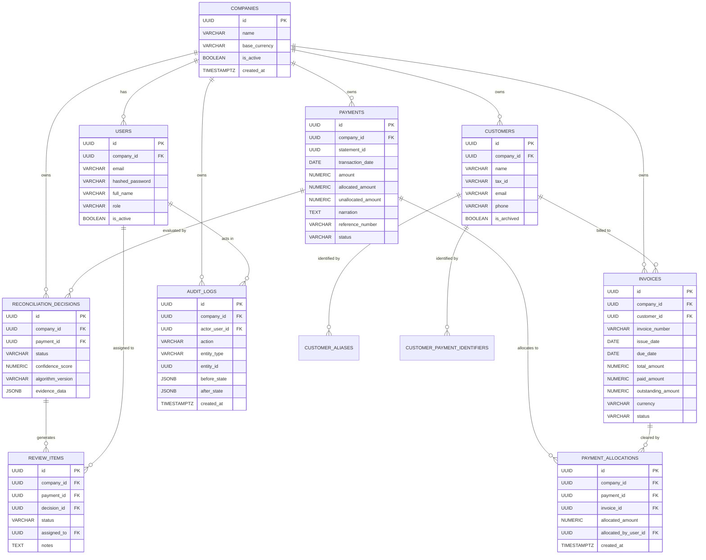

# Entity Relationship Diagram (ERD)

# AI Invoice Reconciliation Platform

```mermaid
erDiagram
    COMPANIES ||--o{ USERS : "has"
    COMPANIES ||--o{ CUSTOMERS : "owns"
    COMPANIES ||--o{ INVOICES : "owns"
    COMPANIES ||--o{ PAYMENTS : "owns"
    COMPANIES ||--o{ RECONCILIATION_DECISIONS : "owns"
    COMPANIES ||--o{ AUDIT_LOGS : "owns"

    CUSTOMERS ||--o{ CUSTOMER_ALIASES : "identified by"
    CUSTOMERS ||--o{ CUSTOMER_PAYMENT_IDENTIFIERS : "identified by"
    CUSTOMERS ||--o{ INVOICES : "billed to"

    PAYMENTS ||--o{ PAYMENT_ALLOCATIONS : "allocates to"
    INVOICES ||--o{ PAYMENT_ALLOCATIONS : "cleared by"

    PAYMENTS ||--o{ RECONCILIATION_DECISIONS : "evaluated by"
    RECONCILIATION_DECISIONS ||--o{ REVIEW_ITEMS : "generates"
    USERS ||--o{ REVIEW_ITEMS : "assigned to"
    USERS ||--o{ AUDIT_LOGS : "acts in"

    COMPANIES {
        UUID id PK
        VARCHAR name
        VARCHAR base_currency
        BOOLEAN is_active
        TIMESTAMPTZ created_at
    }

    USERS {
        UUID id PK
        UUID company_id FK
        VARCHAR email
        VARCHAR hashed_password
        VARCHAR full_name
        VARCHAR role
        BOOLEAN is_active
    }

    CUSTOMERS {
        UUID id PK
        UUID company_id FK
        VARCHAR name
        VARCHAR tax_id
        VARCHAR email
        VARCHAR phone
        BOOLEAN is_archived
    }

    INVOICES {
        UUID id PK
        UUID company_id FK
        UUID customer_id FK
        VARCHAR invoice_number
        DATE issue_date
        DATE due_date
        NUMERIC total_amount
        NUMERIC paid_amount
        NUMERIC outstanding_amount
        VARCHAR currency
        VARCHAR status
    }

    PAYMENTS {
        UUID id PK
        UUID company_id FK
        UUID statement_id
        DATE transaction_date
        NUMERIC amount
        NUMERIC allocated_amount
        NUMERIC unallocated_amount
        TEXT narration
        VARCHAR reference_number
        VARCHAR status
    }

    PAYMENT_ALLOCATIONS {
        UUID id PK
        UUID company_id FK
        UUID payment_id FK
        UUID invoice_id FK
        NUMERIC allocated_amount
        UUID allocated_by_user_id FK
        TIMESTAMPTZ created_at
    }

    RECONCILIATION_DECISIONS {
        UUID id PK
        UUID company_id FK
        UUID payment_id FK
        VARCHAR status
        NUMERIC confidence_score
        VARCHAR algorithm_version
        JSONB evidence_data
    }

    REVIEW_ITEMS {
        UUID id PK
        UUID company_id FK
        UUID payment_id FK
        UUID decision_id FK
        VARCHAR status
        UUID assigned_to FK
        TEXT notes
    }

    AUDIT_LOGS {
        UUID id PK
        UUID company_id FK
        UUID actor_user_id FK
        VARCHAR action
        VARCHAR entity_type
        UUID entity_id
        JSONB before_state
        JSONB after_state
        TIMESTAMPTZ created_at
    }
```
